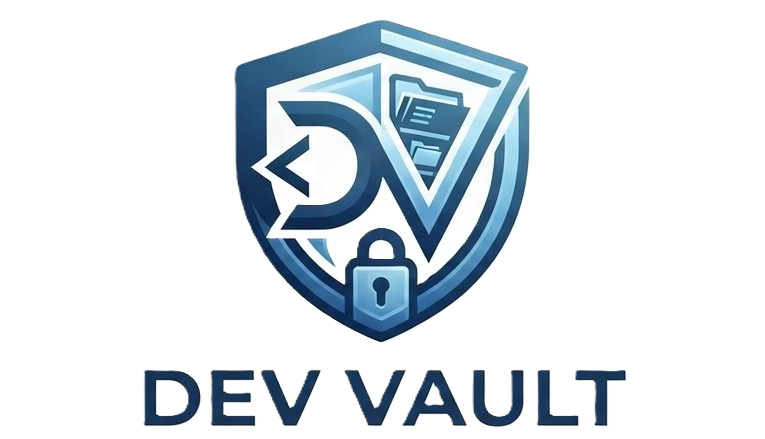

<div align="center">
  
  <p>Repositorio personal de desarrollo y recursos de IA</p>
</div>

---

## 📖 Descripción

**Dev Vault** es un repositorio personal donde se organizan recursos de desarrollo: cuadernos de Kaggle, prompts optimizados, configuraciones, scripts de automatización, instrucciones y apuntes técnicos.

Un solo lugar para mantener las herramientas al alcance.

## 📁 Estructura

```
dev-vault/
├── kaggle/
│   ├── notebooks/          # Cuadernos y análisis de datos
│   ├── datasets/           # Datasets utilizados o creados
│   └── experiments/        # Experimentos y pruebas
├── prompts/                # Prompts optimizados
├── instructions/           # Guías paso a paso
├── configs/                # Configuraciones
├── scripts/                # Scripts de automatización (PowerShell, workers)
└── notes/                  # Apuntes técnicos y documentación
```

## 🚀 Uso

1. Navegar a la carpeta correspondiente según el recurso
2. Consultar guías en `instructions/` para procedimientos
3. Revisar scripts en `scripts/` para automatización
4. Referenciar apuntes en `notes/` para documentación

## 📌 Recursos

- **Kaggle**: Cuadernos y datasets en `/kaggle`
- **Prompts**: Colección optimizada en `/prompts`
- **Configs**: Configuraciones y templates en `/configs`
- **Scripts**: Automatización y workers en `/scripts`
- **Guías**: Instrucciones paso a paso en `/instructions`

## 🛠️ Tecnologías que se usan

- 💻 Desarrollo general
- 🤖 Inteligencia Artificial
- 📊 Ciencia de Datos
- ⚙️ Automatización con PowerShell
- 📝 Documentación y apuntes

---

<div align="center">
  <p><i>Dev Vault - Espacio personal de desarrollo</i></p>
</div>
